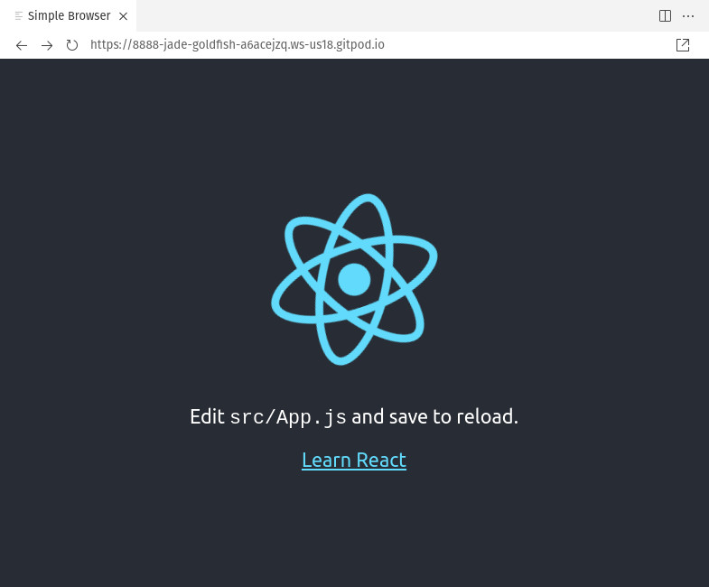

# Write Your Own Web Store In Hours


## 🪄 Create a default React App

👉💻👈 Use `npx` to deploy a default react app

```shell
npx create-react-app webstore
```

👉💻👈 Start the Netlify Development Server

```shell
cd webstore
netlify dev
```


**🎉 You should now see this web application in the preview pane 🎉**



## Building out a Basic Web App

By the end of this project, we'll have a home page and a success page, but typically you'd have plenty more. Let's configure a proper routing handler to allow for this.


## Routing

👉💻👈 Install React Router

```shell
npm install react-router-dom
```


## Skeleton Files

> ⚠️ **Note**
>
> Make sure you create all these files in the `webstore` directory, not in the repository root.

Let's create the following files, which will set you up for easily adding more pages in the future:

- [x] a template component
- [x] a Home component
- [x] a Success component
- [x] routing configuration to handle requests for these two pages


👉💻👈 Create `/src/components/layout.js`

```javascript
import React from "react";
import { Link } from "react-router-dom";

const Layout = ({ children }) => {
  return (
    <>
      <header>
        <h1>My Web Store</h1>
        <nav>
          <ul>
            <li>
              <Link className="menuitem" to="/">
                Home
              </Link>
            </li>
          </ul>
        </nav>
      </header>
      <main>{children}</main>
    </>
  );
};

export default Layout;
```


👉💻👈 Create `/src/pages/home.js`

```javascript
import React from "react";

const Home = () => {
  return (
    <>
      <h1>Home</h1>
      <p>Welcome to my web store!</p>
    </>
  );
};

export default Home;
```


👉💻👈 Create `/src/pages/success.js`

```javascript
import React from "react";

const Success = () => {
  return (
    <>
      <h1>Thanks for your order!</h1>
      <p>Your order has been received.</p>
    </>
  );
};

export default Success;
```


👉💻👈 Update `/src/App.js`

```javascript
import React from "react";
import { BrowserRouter, Routes, Route } from "react-router-dom";

import Layout from "./components/layout";
import Home from "./pages/home";
import Success from "./pages/success";

import "./App.css";

const App = () => {
  return (
    <BrowserRouter>
      <Layout>
        <Routes>
          <Route path="/success" element={<Success />} />
          <Route path="/" element={<Home />} />
        </Routes>
      </Layout>
    </BrowserRouter>
  );
};

export default App;
```


🧪 Make sure `netlify dev` is still running and check out your new web site. Manually add `/success` to the end of the URL to test the second page.

💡 Make this look much prettier by replacing `/src/App.css` with the contents of [`/workshop-assets/App.css`](https://raw.githubusercontent.com/bendechrai/write-your-own-web-store-in-hours/main/workshop-assets/App.css) in this repo.


---

[▶️ STEP 3: Defining products in Stripe](./STEP-3-DEFINING-PRODUCTS-IN-STRIPE.md)

_[⎌ Back to step 1: Setting up your development environment](./STEP-1-DEVELOPMENT-ENVIRONMENT.md)_
